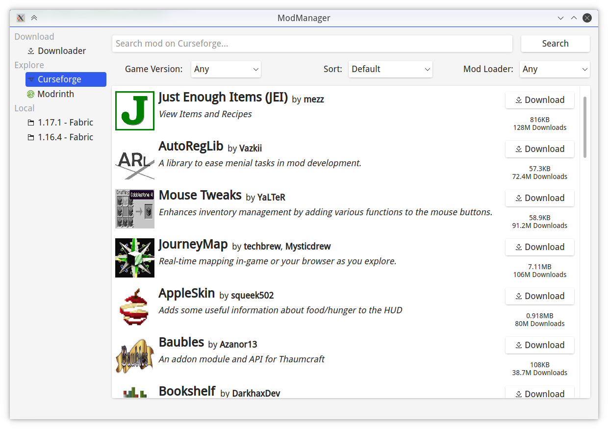
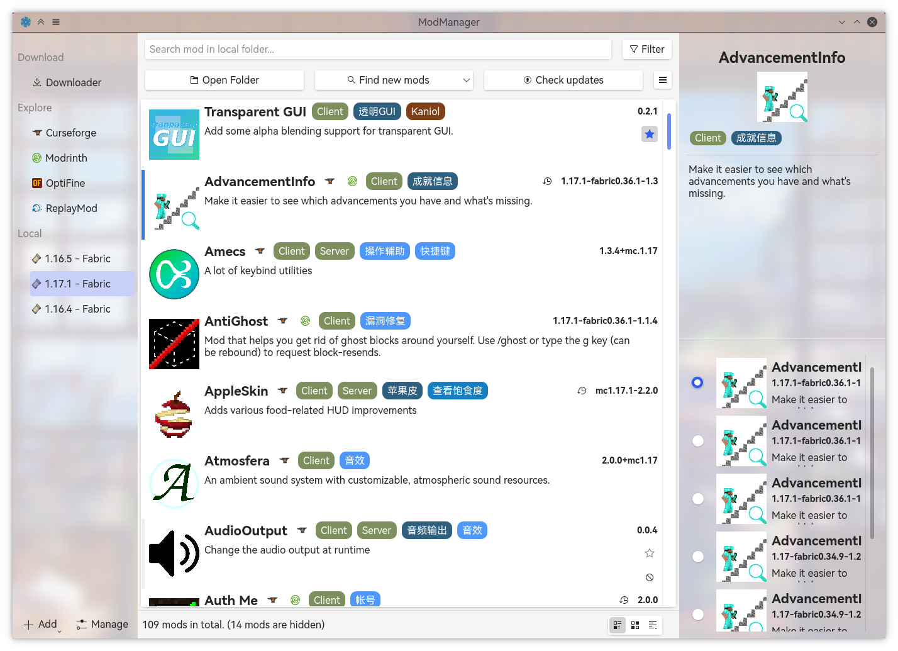

<br />

<h1>Mod Manager</h1>

   [](https://www.codefactor.io/repository/github/kaniol-lck/modmanager) [](Changelog.md) [](https://github.com/kaniol-lck/modmanager/releases) [](https://github.com/kaniol-lck/modmanager/actions/workflows/ci.yml)

**English** | [中文](README_zh.md)

A Qt-based mod manager for Minecraft, able to manage, update and download mod.

## License

Mod Manager is licensed under [GPLv3](LICENSE).

## Installation

See [Release](https://github.com/kaniol-lck/modmanager/releases).

## Build

This repository has deployed [GitHub Actions](https://github.com/kaniol-lck/modmanager/actions). If you want to try my new-written bugs, welcome to try it and open some issues.

### Build From Source

Clone this repository: 

```bash
git clone git@github.com:kaniol-lck/modmanager.git
```

#### Install dependencies

This project has these external dependencies:

- Qt (5.15.2 or maybe other versions)
- quazip
- libaria2

Depends on your OS and package managers:

- Ubuntu (apt-get):

  ```sh
  apt-get install libaria2-0-dev libquazip5-dev
  ```

- Archlinux:

  ```sh
  pacman -S aria2 quazip
  ```

- Windows (MSYS2):

  ```sh
  pacman -S mingw-w64-x86_64-aria2 mingw-w64-x86_64-quazip
  ```

- MacOS:
  
  ```sh
  brew install quazip
  ```
  libaria2: see [kaniol-lck/aria2 Releases](https://github.com/kaniol-lck/aria2/releases/tag/release-1.36.0) for install instructions.
  

#### Compile

```bash
qmake && make
```

## Usage

(Background in images is my wallpaper, because toolbar is semi-transparent on KDE)

### Explore - Download Mod

You can browse and download mod from:

- Curseforge
- Modrinth
- OptiFine
- ReplayMod



### Local - Manage Mod

You can browse and manage your local mod:

- update & rollback
- tag your mods
- batch rename
- disable mods


