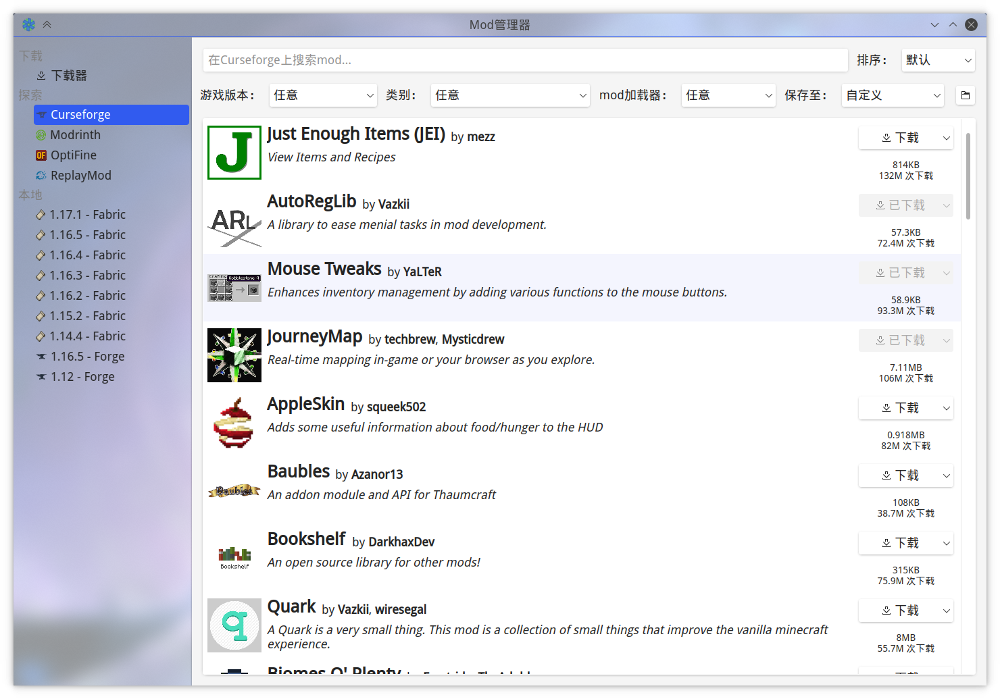
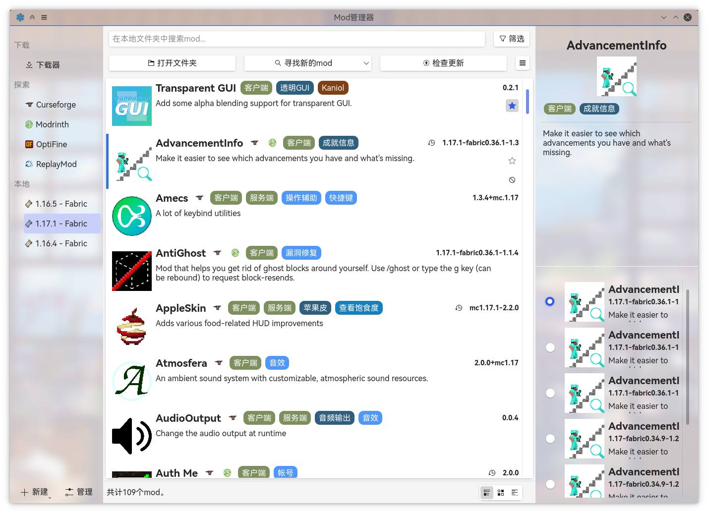

<br />

<h1>Mod管理器</h1>

    [](https://www.codefactor.io/repository/github/kaniol-lck/modmanager)  [](Changelog.md) [](https://github.com/kaniol-lck/modmanager/releases)

[English](README.md) | **中文**

一个基于Qt的Minecraft Mod管理器，可以管理、更新与下载Mod。

## License

Mod管理器以[GPLv3](LICENSE)许可证发布。

## 构建

本项目已经配置了[GitHub Actions](https://github.com/kaniol-lck/modmanager/actions)，如果你想要尝试最新鲜的bug，可以直接在其中选择下载并帮我捉虫。

### 构建状态

| 平台          | 状态                                                         |
| ------------- | ------------------------------------------------------------ |
| Windows MinGW | [](https://github.com/kaniol-lck/modmanager/blob/master/.github/workflows/windows-mingw.yml) |
| Windows MSVC  | [](https://github.com/kaniol-lck/modmanager/blob/master/.github/workflows/windows-msvc.yml) |
| Linux         | [](https://github.com/kaniol-lck/modmanager/blob/master/.github/workflows/ubuntu.yml) |
| Mac OS        | *未知\**                                                     |

\* Mac OS的Github Actions构建在C++ 17的部分失败了（我也不知道是不是原先用的actions写的有问题）。

### 从源码构建

克隆本仓库至本地：

```bash
git clone git@github.com:kaniol-lck/modmanager.git
```

#### 对于GCC/MinGW

构建：

```bash
qmake && make
```

#### 对于MSVC

安装zlib（详见[zlib.install](https://github.com/horta/zlib.install)）：

```bash
powershell -Command "(Invoke-WebRequest -Uri https://git.io/JnHTY -OutFile install_zlib.bat)"; ./install_zlib.bat; del install_zlib.bat
```

构建：

```bash
qmake && nmake
```

## 使用

（图中的背景是我的桌面，因为工具栏在KDE上是半透明的）

### 探索 - 下载Mod

你可以从这些网站上浏览并下载mod：

- Curseforge
- Modrinth
- OptiFine
- ReplayMod



### 本地 - 管理Mod

你可以浏览并管理你的本地mod：

- 更新&回退
- 为mod添加标签
- 批量重命名
- 禁用mod

